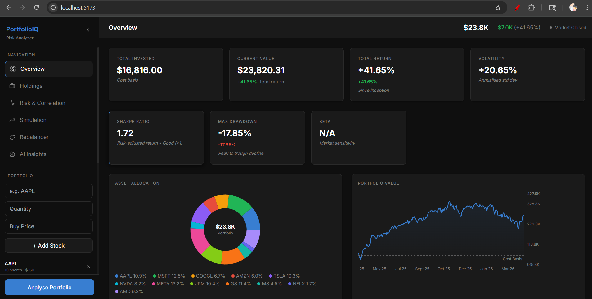
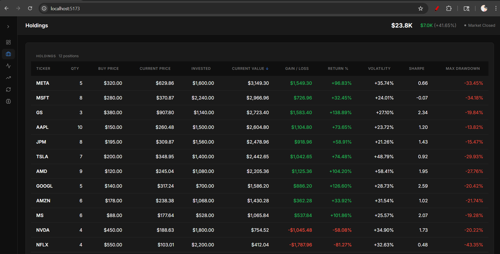
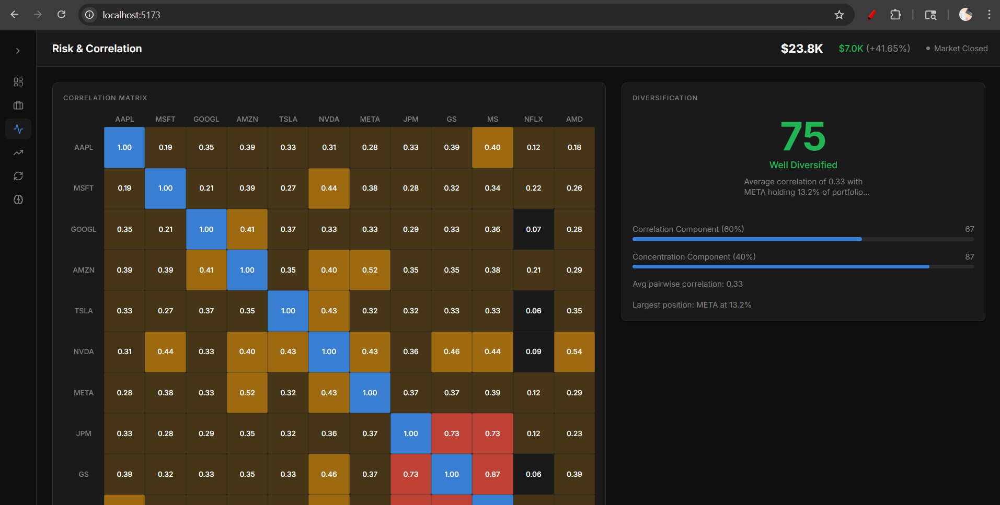
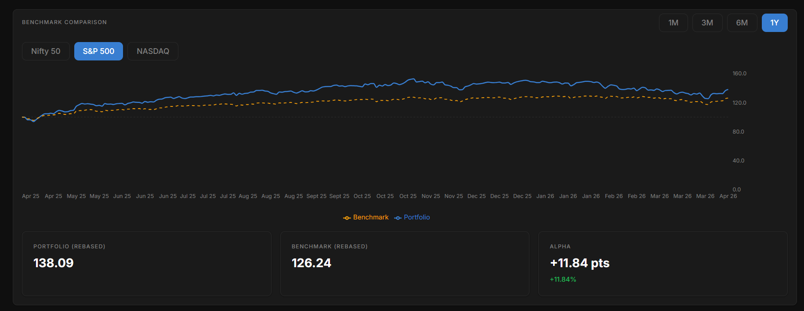
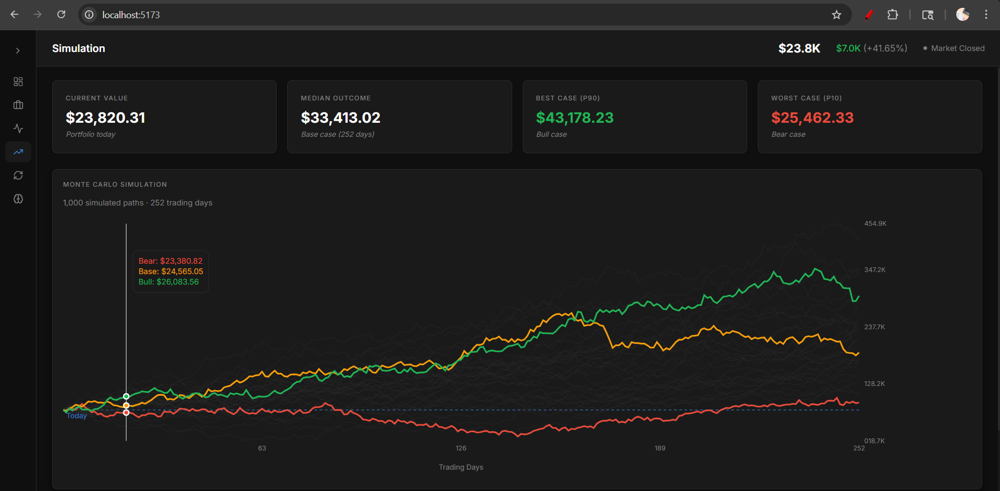
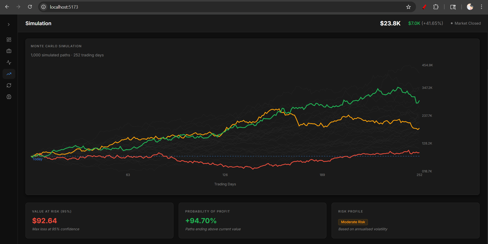
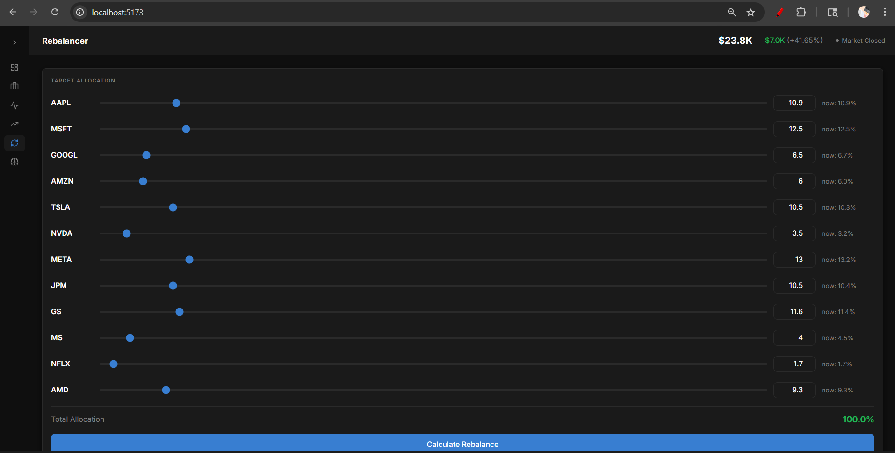
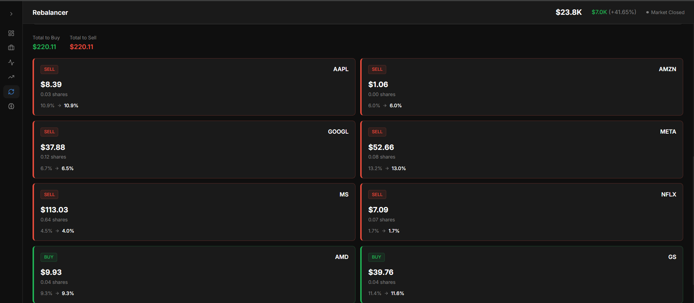
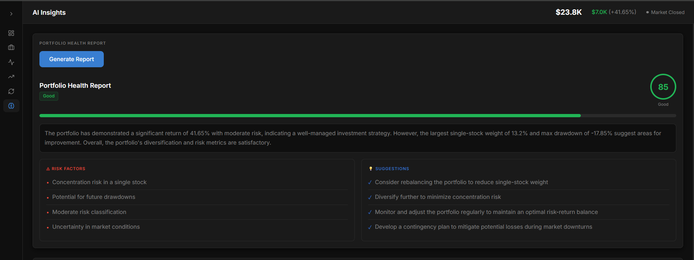
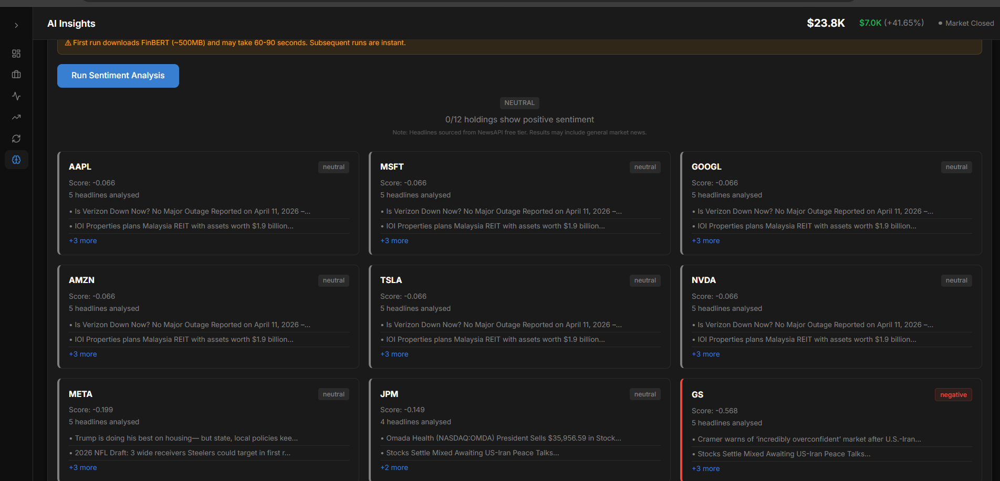

# PortfolioIQ — Portfolio Risk Analyzer

A full-stack financial dashboard for analyzing portfolio performance, 
risk metrics, and AI-driven insights. Built with FastAPI, React, 
FinBERT sentiment analysis, and Monte Carlo simulation.

## Live Features

- **Real-time market data** via Yahoo Finance API
- **Risk metrics** — Sharpe Ratio, Beta, Max Drawdown, Volatility
- **Monte Carlo Simulation** — 1,000 path projection over 252 trading days
- **Benchmark Comparison** — Portfolio vs S&P 500, NASDAQ, Nifty 50
- **Correlation Analysis** — Heatmap + Diversification Score
- **Portfolio Rebalancer** — Target allocation with trade instructions
- **AI Health Report** — LLaMA 3.3 (via Groq) portfolio analysis
- **News Sentiment** — FinBERT NLP classification on live headlines

## Tech Stack

### Backend
- **FastAPI** — layered backend architecture (routers → controllers → services)
- **Python** — pandas, numpy, yfinance
- **Groq API** — LLaMA 3.3 70B for AI health reports
- **FinBERT** — HuggingFace transformer for financial sentiment
- **NewsAPI** — Live news headlines per ticker

### Frontend
- **React + Vite** — Modern frontend tooling
- **Tailwind CSS** — Dark fintech design system
- **Recharts** — Interactive financial charts
- **React Query** — Server state management

## Project Structure
```
portfolio-risk-analyzer/
├── backend/
│   ├── main.py                    # FastAPI entry point
│   ├── api/
│   │   ├── controllers/           # Business logic layer
│   │   ├── routers/               # Route definitions
│   │   └── models/                # Pydantic request/response models
│   └── src/
│       ├── portfolio_fetcher.py   # Yahoo Finance data fetching
│       ├── portfolio_analytics.py # Metrics computation
│       ├── correlation.py         # Correlation matrix + diversification
│       ├── simulation.py          # Monte Carlo simulation
│       ├── rebalancer.py          # Rebalancing trade computation
│       ├── ai_analyst.py          # Groq LLM health report
│       └── sentiment.py           # FinBERT news sentiment
└── frontend/
    └── src/
        ├── pages/                 # 6 dashboard pages
        ├── components/            # Reusable UI components
        ├── api/                   # API client
        ├── hooks/                 # React Query hooks
        └── store/                 # Global state (Context + useReducer)
```

## Setup

### Prerequisites
- Python 3.10+
- Node.js 18+
- Conda (recommended)
- Groq API key (free at console.groq.com)
- NewsAPI key (free at newsapi.org)

### Backend
```bash
cd backend
conda create -n portfolio-analyzer python=3.10
conda activate portfolio-analyzer
pip install -r requirements.txt

# Create .env file
echo "GROQ_API_KEY=your_key_here" > .env
echo "NEWS_API_KEY=your_key_here" >> .env

# Start server
uvicorn main:app --reload --port 8000
```

### Frontend
```bash
cd frontend
npm install
npm run dev
```

Open `http://localhost:5173`

## API Endpoints

| Method | Endpoint | Description |
|--------|----------|-------------|
| POST | `/api/portfolio/analyse` | Full portfolio analytics |
| POST | `/api/portfolio/benchmark` | Benchmark comparison |
| POST | `/api/analysis/correlation` | Correlation matrix |
| POST | `/api/analysis/simulate` | Monte Carlo simulation |
| POST | `/api/analysis/rebalance` | Rebalancing trades |
| POST | `/api/analysis/health-report` | AI health report |
| POST | `/api/analysis/sentiment` | News sentiment |
| GET | `/api/system/health` | Health check |

## Key Metrics

| Metric | Formula |
|--------|---------|
| Sharpe Ratio | `(mean_return / std_return) × √252` |
| Volatility | `std(daily_returns) × √252` |
| Max Drawdown | `(peak - trough) / peak × 100` |
| Beta | `cov(portfolio, benchmark) / var(benchmark)` |
| VaR 95% | `current_value - percentile(simulated_values, 5)` |

## Notes

- FinBERT first load downloads ~500MB model weights (cached after first run)
- News sentiment uses NewsAPI free tier (100 req/day limit)
- Yahoo Finance rate limiting may affect data fetching on restricted networks
- All prices are in USD

## License

MIT License


## Screenshots

### Overview Dashboard
Get a bird's-eye view of your entire portfolio — total invested, current value, returns, volatility, Sharpe ratio, max drawdown, asset allocation donut chart, and a live portfolio value chart against your cost basis.



---

### Holdings
A detailed per-stock breakdown across 12 positions. Columns include quantity, buy price, current price, invested amount, current value, gain/loss, return %, volatility, Sharpe ratio, and max drawdown — all in a clean sortable table.



---

### Risk & Correlation
An interactive correlation matrix across all holdings with colour-coded intensity (blue = low, red = high). The right panel shows a diversification score (75 — Well Diversified), average pairwise correlation, and concentration breakdown.



---

### Benchmark Comparison
Rebase your portfolio against Nifty 50, S&P 500, or NASDAQ over 1M / 3M / 6M / 1Y windows. Displays portfolio vs benchmark performance and alpha generated.



---

### Monte Carlo Simulation — Paths
1,000 simulated price paths over 252 trading days visualised as bull (green), base (orange), and bear (red) scenario lines with an interactive cursor tooltip.



---

### Monte Carlo Simulation — Risk Metrics
Below the simulation chart: Value at Risk at 95% confidence ($92.64), probability of profit (94.70%), and a risk profile classification (Moderate Risk based on annualised volatility).



---

### Rebalancer — Target Allocation
Set target weights for each holding using sliders. The total allocation counter updates live and locks at 100% before allowing rebalancing to be calculated.



---

### Rebalancer — Trade Suggestions
After calculating, the rebalancer outputs exact buy/sell instructions per stock — dollar amount, share count, and the allocation shift — so you know precisely what trades to execute.



---

### AI Insights — Portfolio Health Report
One-click AI-generated portfolio health report powered by LLaMA 3.3 70B via Groq. Returns an overall score (85 — Good), a plain-English summary, flagged risk factors, and actionable suggestions.



---

### AI Insights — FinBERT Sentiment Analysis
Per-stock news sentiment analysis using FinBERT. Pulls live headlines via NewsAPI and scores each holding — positive, neutral, or negative — with source headlines displayed inline.

